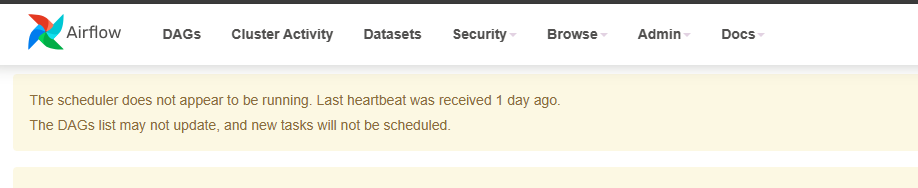
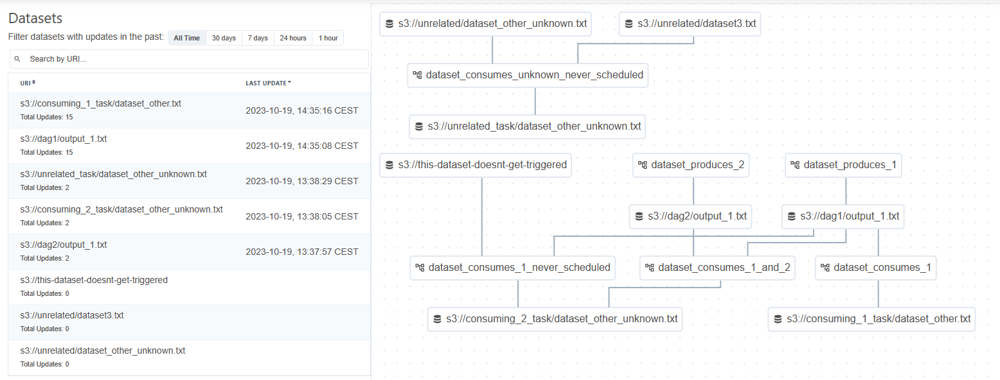
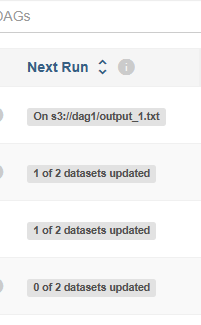

# Airflow


## Important information
Use WSL to install and run ``airflow`` if using Windows.
When ``airflow webserver`` is executed, then the UI can be accessed *via* a browser at localhost:8080
``airflow scheduler [-D|--daemon]`` may be required if the following message is displayed by the UI.


## Definitions
- task : "basic unit of execution" of Airflow, dependencies between several tasks form a DAG. They have a unique identifier (`task_id`). Tasks can receive args explicitly or _via_ `default_args`, which are passed to `DAG` constructor ; default args can be overriden. There is 3 kinds of task :
  - [Operator](https://airflow.apache.org/docs/apache-airflow/stable/core-concepts/operators.html) : template for predefined tasks (e.g. BashOperator, etc), classical approach to defining DAGs
  - [Sensor](https://airflow.apache.org/docs/apache-airflow/stable/core-concepts/sensors.html) : special type of ``operator`` designed for waiting for an event (time-based or not) or a file
  - "[TaskFlow](https://airflow.apache.org/docs/apache-airflow/stable/tutorial/taskflow.html)-decorated" one : a Python function decorated by `@task`
- DAG : structure defined in a Python file (which is in fact a configuration one). There should be **no data processing** inside it ! The file **is intended to be interpreted quickly** by the scheduler.
- [Logical date](https://airflow.apache.org/docs/apache-airflow/stable/core-concepts/dags.html#concepts-dag-run) (or `@deprecated` *execution date*) : Functional date used by the DAG. Quite different from the date of the execution of the DAG. For ex., we're on 05/26 and want to process one-week-old data : the logical date will be 05/19.
- [Data interval](https://airflow.apache.org/docs/apache-airflow/stable/core-concepts/dag-run.html#data-interval) : Represents the time range over which a DAG is executed, can be `@hourly`, `@daily`, etc. ``Logical date`` represents the beginning of a `data interval`. If scheduled, the DAG will be first executed once `logical date + 1st data interval` is ended. *Indeed, if we want to process data daily, the DAGs will be executed once each day is over.*
- `Catchup` and `backfill` : actually the same thing but occurring at different moments :
  - [catchup](https://airflow.apache.org/docs/apache-airflow/stable/core-concepts/dag-run.html#catchup) : when defining a DAG, if `catchup` argument is set to `True`, the scheduler will execute a DAG for every date where there is no `logical date`.
  - [backfill](https://airflow.apache.org/docs/apache-airflow/stable/core-concepts/dag-run.html#backfill) : capacity to execute a DAG over a period of time (prior to `start_date`!), executed on demand *via* `airflow dags backfill -s <start_date> -e <end_date> <DAG id>`
- `DAG` run : instantiation of a DAG
- [Dynamic Task Mapping](https://airflow.apache.org/docs/apache-airflow/stable/authoring-and-scheduling/dynamic-task-mapping.html) : way to create tasks according to input data. A reduce task is not necessary. Such tasks are represented by "<task name **[]**>" in the UI.
- `macros` : Python modules that can be injected inside templates. Airflow comes with several ones [but custom ones can be added](https://airflow.apache.org/docs/apache-airflow/stable/templates-ref.html) through [plugins](https://airflow.apache.org/docs/apache-airflow/stable/authoring-and-scheduling/plugins.html)

Note: Tasks support [Jinja templating](https://jinja.palletsprojects.com/en/3.0.x/)

## Useful command lines
### Before invoking the UI
It's necessary to create a user thanks to the following command
``airflow users create --username <name> --firstname <firstname> --lastname <lastname> --role Admin|User|Op|Viewer|PUblic--email <mail> --password <pswd>``

### When writing a new DAG
- ``python <path/to/dag>.py #should return no error`` 
- ``airflow task test <DAG id> <task id>`` : executes <task id> from <DAG id>
- ``airflow dags test <DAG id> [--subdir <subdir>]`` : executes <DAG id> (located in <subdir>, if need be)

### Miscellaneous
- ``airflow tasks list <DAG id> [--tree]`` : prints the tasks for a given DAG (+ task' hierarchy with --tree flag)
- ``airflow dags list`` : prints the DAGs seen in $AIRFLOW_HOME (should be ~/airflow/dags)
- ``airflow tasks render <DAG id> <task ID> <execution_date_kr_run_id>`` : prints a given task's rendering
- ``airflow plugins`` : get information about loaded plugins, if any

## Scheduling
DAGs can be parametrized (i.e. using the `schedule` argument) so that they get executed at a defined moment or when a dataset is available.
### Definitions (see above)
### Time-based
To schedule time-based DAGs, Airflow provides 2 ways
#### Cron related
Scheduling DAGs can be done thanks to cron's syntax, including presets, here's an excerpt :

| cron preset  | cron "normal" syntax |
|--------------|----------------------|
| "@hourly"    | "0 * * * *"          |
| "@dayly"     | "0 0 * * *"          |
| "@monthly"   | "0 0 1 * *"          |
| NA | "*/5 * * * *"        |

For example, a DAG can be scheduled to run every 5 minutes this way :
``DAG(
    <kwargs>,
    schedule="*/5 * * * *"
)``
> **Note** : Cron instructions are internally converted by Airflow to Timetables
#### Timetables related
[Timetables](https://airflow.apache.org/docs/apache-airflow/stable/authoring-and-scheduling/timetable.html) are to be used when cron instructions are not enough or when a schedules do not use Gregorian calendar, e.g. when a DAG must be scheduled according to dawn or dusk.
> **Note** : Built-in Timetables exist that can deal with cron expression or data intervale

The main differences between `CronTriggerTimetable` and `CronIntervalTimetable` are [summarized below](https://airflow.apache.org/docs/apache-airflow/stable/authoring-and-scheduling/timetable.html#differences-between-the-two-cron-timetables) :

|                                                 | CronThriggerTimetable                           | CronIntervalTimetable                 |
|-------------------------------------------------|-------------------------------------------------|---------------------------------------|
| Interval                                        | Ignored, interval_data_start = interval_data_end | Cared                                 |
| if `catchup` == false and `start_date` is past time | Runs the DAG *after* the current date           | Runs the DAG *before* the actual date |


### Data-based
One can define dependencies between DAGs via datasets (see below the UI)

This way, the DAG will be executed once datasets are available.
To do so, the DAG must receive a dataset has argument :
``````python
# traditional API
#producer
<dataset_name> = Dataset(<dataset_s_URI>) # no regex ou glob pattern allowed here
with DAG(<kwargs>) as dag:
    <Operator>(outlets=[<dataset_name>], <other kwargs>)
    
#consumer
DAG(
    <kwargs>,
    schedule=[<dataset_name>] # list of dependencies
)
``````

````python
#TaskFlow API
#producer
<dataset_name> = Dataset(<dataset_s_URI>) # no regex ou glob pattern allowed here
@dag(
    <kwargs>
)
def prod():
    @task(outlets=[<dataset_name>])
    def t_prod():
        #some transformations to produce <dataset_name>

#consumer
@dag(
    <kwargs>,
    schedule=[<dataset_name>] # list of dependencies 
)
````
[Dataset URI](https://airflow.apache.org/docs/apache-airflow/stable/authoring-and-scheduling/datasets.html) **must not** store sensitive data. 

The UI then displays the following information regarding next runs 

## REST API
Airflow provides a REST API, its documentation can be accessed at the following address:
```<server_name>:8080/api/v1/ui```

DAGs can be launched, deleted, etc, thanks to this API.
 
## DAG configuration file's structure
### "Default" API (prior to Airflow 2.0)
````python
from airflow import DAG

from airflow.operators.<ope> import <myOperator>
from airflow.operators.python import PythonOperator

with DAG(
    <args>,
    default_args = {...}
) as dag:
  def my_func(**kwargs):
    ti = kwargs["ti"] #task instance
    <var> = ti.xcom_pull(task_ids="...", key ="...") #cross communication enables tasks communication
    <processed_var> = <processing on <var>>
    ti.push("<key>", <processed_var>)

    <my_task_object_1> = PythonOperator(
      task_id=...,
      python_callable=my_func
                      <other args>
    )
    <my_task_object_2> = <myOperator>(
        task_id=...,
    <overridden default arg, if any>
    <other args>
    )
    ...
    <my_task_object_n> = <myOperator>(
        task_id=...,
    <other args>
    )

    # 3 ways to say that my_task_object_2 depends and  my_task_object_1
    my_task_object_1.set_downstream(my_task_object_2)
    my_task_object_1 >> my_task_object_2
    chain(my_task_object_1, my_task_object_2)
    

    my_task_object_1 >> [my_task_object_2, my_task_object_n]

    my_task_object_2 << my_task_object_1
    # is the same as
    my_task_object_2.set_upstream(my_task_object_1)
````
### [TaskFlow API](https://airflow.apache.org/docs/apache-airflow/stable/tutorial/taskflow.html) 
````python
from airflow.decorators import dag, task

@dag(
    schedule = ...,
    start_date =  ...,
    catchup = True | False
)
def <DAG_s_name>():
    @task(<args if need be>)
    def <my_fun>():
        #some stuff
        return if any
    
    @task(<args if need be>)
    def <my_second_fun>(<args>):
        #some stuff again
        
    <var> = <my_func>()
    <my_second_fun>(<var>)

<DAG_s_name>()
````
## Misc
### Templating
[Templating](https://jinja.palletsprojects.com/en/3.0.x/) is used to pass dynamic information to tasks at runtime.
As far as I understand : may only be used with BashOperator
### Branching
Airflow supports branching : a decorated task ca be use with `@task.branch`.
But to order the task operator `>>` must be used with the 'joining' task 
### Executing a collection of tasks in a sequential way
`chain(<first_task>,* <collection>)`


## Additional resources
- [Dealing with datasets](https://docs.astronomer.io/learn/airflow-datasets) 
- https://docs.astronomer.io/learn/templating
- https://docs.astronomer.io/learn/intro-to-airflow
- [Multiple Python versions on Windows](https://stackoverflow.com/questions/4583367/how-to-run-multiple-python-versions-on-windows)