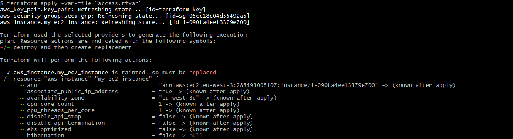

# Terrafrom cheatsheet

## [Installing Terraform and Azure CLI](https://developer.hashicorp.com/terraform/tutorials/azure-get-started/infrastructure-as-code)

### Terraform

- Binaries can be downloaded from [here](https://developer.hashicorp.com/terraform/downloads)
- Check the SHA256 fingerprint then unzip the package
- Path variable should be updated in order to use `terraform` everywhere

### Azure CLI
- A valid Azure account and subscription is required to perform the other actions
- Install [Azure CLI](https://learn.microsoft.com/en-us/cli/azure/install-azure-cli-windows?tabs=azure-cli)
- Login thanks to `az login`, a prompt should open in the browser and an `id` should be printed on the CLI : this `id` is to be reused afterwars
- `az account set --subscription "<id>"`
- `az ad sp create-for-rbac -role="Contributor" --scopres=/subscriptions/<id>`
- Tokens should be printed, and need to be stored as environment variables thanks to :
    - `export ARM_CLIENT_ID="<appId>"`
    - `export ARM_CLIENT_SECRET="<password>"`
    - `export ARM_SUBSCRIPTION_ID="<id>"`
    - `export ARM_TENANT_ID="<tenant>"`

### AWS
- A valid AWS account is required
- Create in IAM a user dedicated to using Terraform (and thus avoiding using the root user)
- Once created, open its details in IAM
- Set the `AmazonEC2FullAccess` and `AmazonS3FullAccess` policies on the aforementioned user
- Create access key for it, to allow programmatic access to AWS, this secret is to be used by the aws `provider`

## Usefull commands
- `terraform init` downloads providers and prepare the env
- `terraform plan` prints the different actions that Terraform plans to do according to `main.tf` file
- `terraform fmt` reformate files to a canonical form if need be, changed files are printed afterwards
- `terraform apply [-var "<var_name>=<var_value>]` apply Terraform's plan, variables may be overriden
- `terraform destroy` the exact opposite of `terraform apply`
- `terraform taint <provider_resourceType>.<resourceName>` : marks a resource as "tainted" : it will be dropped and recreated during the next `apply` execution, as seen below
  

## Terraform documentation
https://developer.hashicorp.com/terraform/language

