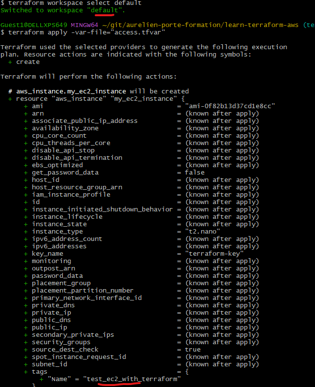
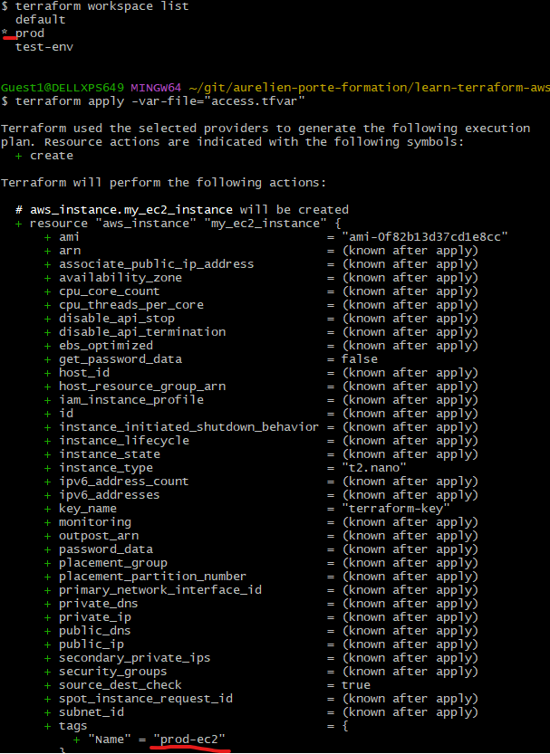

# Terrafrom cheatsheet

## [Installing Terraform and Azure CLI](https://developer.hashicorp.com/terraform/tutorials/azure-get-started/infrastructure-as-code)

### Terraform

- Binaries can be downloaded from [here](https://developer.hashicorp.com/terraform/downloads)
- Check the SHA256 fingerprint then unzip the package
- Path variable should be updated in order to use `terraform` everywhere

### Azure CLI
- A valid Azure account and subscription is required to perform the other actions
- Install [Azure CLI](https://learn.microsoft.com/en-us/cli/azure/install-azure-cli-windows?tabs=azure-cli)
- Login thanks to `az login`, a prompt should open in the browser and an `id` should be printed on the CLI : this `id` is to be reused afterwards
- `az account set --subscription "<id>"`
- `az ad sp create-for-rbac -role="Contributor" --scopres=/subscriptions/<id>`
- Tokens should be printed, and need to be stored as environment variables thanks to :
    - `export ARM_CLIENT_ID="<appId>"`
    - `export ARM_CLIENT_SECRET="<password>"`
    - `export ARM_SUBSCRIPTION_ID="<id>"`
    - `export ARM_TENANT_ID="<tenant>"`

### AWS
- A valid AWS account is required
- Create in IAM a user dedicated to using Terraform (and thus avoiding using the root user)
- Once created, open its details in IAM
- Set the `AmazonEC2FullAccess` and `AmazonS3FullAccess` policies on the aforementioned user
- Create access key for it, to allow programmatic access to AWS, this secret is to be used by the aws `provider`


## Useful commands
- `terraform init` downloads providers and prepare the env
- `terraform plan` prints the different actions that Terraform plans to do according to `main.tf` file
- `terraform fmt` reformat files to a canonical form if need be, changed files are printed afterwards
- `terraform apply [-var "<var_name>=<var_value>]` apply Terraform's plan, variables may be overriden
- `terraform destroy` the exact opposite of `terraform apply`
- `terraform taint <provider_resourceType>.<resourceName>` : marks a resource as "tainted" : it will be dropped and recreated during the next `apply` execution, as seen below
  

## Terraform's functionalities
### Backend

### Workspaces
Enable the use of the same scripts to create resources with, for example, different names
e.g. the EC2 resource's name changes according to the workspace in which we are
- `default` workspace
  - 
- `prod` workspace
  - 

### Data resources
#### Relative to a provider
Can use a provider API to gather some information, for example an AMI id

### External 
Can acquire data coming for example from a script
Should be a last resort option because it creates dependencies outside Terraform
e.g. using an external script to change a resource's name :


### Modules
A module his some kind of library, used to slice config in order to reuse it and to avoid code duplication
A module is composed of
- a folder
  - `main.tf`
  - `outputs.tf` if need be
  - `variables.tf` is need be

A module must be declared in order to be used, plus `terraform init` is mandatory in order to import it
Modules can be found online.


### Meta arguments
#### for_each
`for_each` [is used as a preferred alternative](https://developer.hashicorp.com/terraform/language/meta-arguments/for_each) over `count`

It's used this way 

````terraform
for_each = toset(<a list>) # or <my_map>
<field_name> = each.key # each.value can be used with a map
```` 

#### Dynamic blocks
Repeatable configuration inside a top-level block (e.g. resource) can require repetitive information.
Code duplication can be avoided thanks to dynamic blocks : the repetition will be done during runtime.
````terraform
resource "aws_autoscaling_group" "grp_name"  {
  tag {
    #tag #1 content
  }
  # .
  # .
  # .
  tag {
    #tag #n content
  }
}
````
can be changed this way

````terraform
variable "TAG_CONTENT" {
  type = map
  # tags content
}

resource "aws_autoscaling_group" "dyna_grp_name" {
  dynamic "tag" {
    for_each = var.TAG_CONTENT
    content {
      #tag content making use of tag.key and tag.value
    }
  }
}
````

#### For loops
`for <var> in <collection> : <actions>`

## Terraform documentation
https://developer.hashicorp.com/terraform/language

